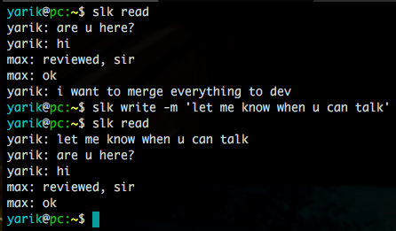

# SLK - minimalistic slack cli

For those (like myself) who don't like slack to be opened 95% of the time.

### Usage

- `slk setup -t=<slack-token> -c=<channel-id>`
- `slk write -m="hello max"`
- `slk read`

